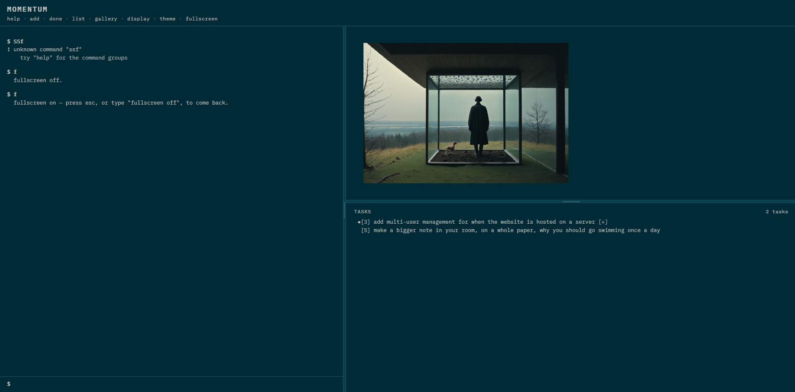

# Momentum

**A command-line task manager where finishing your work uncovers a piece of art.**

Every task you complete reveals part of a hidden ASCII artwork or image. Finish enough of them and the piece is yours — saved to a permanent gallery, or downloaded to your machine. Then a new one starts, still hidden.

It's a deliberate experiment in self-conditioning: pairing the boring, necessary act of crossing something off a list with a small, visible, accumulating reward.

```
$ add water the plants
added #1 "water the plants"

$ done 1
#1 "water the plants" done! moved to the archive.
```

*...and in the art panel, a little more of the picture appears.*

<!-- SUGGESTED: a short looping GIF right here — type a task, complete it, watch blocks
     pop off the image. ~10 seconds, no audio needed. This is the single highest-value
     addition to this README: the whole app is a visual feedback loop, and no amount of
     prose does what five seconds of watching it does. Record at a narrow window size so
     it stays readable at GitHub's ~800px content width. -->

---

## Gallery

<table>
  <tr>
    <td colspan="2">
      
      <br><em><b>The default layout.</b> Console on the left, the piece you're uncovering top-right, your task list underneath it. This one's fully revealed and on the <code>solar</code> theme; note the <code>•</code> in the margin of task <code>[3]</code> — that's a mark, and there's <a href="#reading-the-task-list">a whole column of them</a>.</em>
    </td>
  </tr>
  <tr>
    <td width="50%">
      
      <br><em><b>A finished piece.</b> 96 of 96 blocks uncovered — the app offers to save it to the gallery or download it, then starts a new one, hidden.</em>
    </td>
    <td width="50%">
      
      <br><em><b>Ascii mode, amber.</b> Here the artwork has been given the full-height column with <code>view art</code> — one of three arrangements you can pick between.</em>
    </td>
  </tr>
  <tr>
    <td width="50%">
      
      <br><em><b>The nord theme.</b> Ten themes ship — from <code>dos</code> (white on IBM blue) to <code>paper</code> and <code>noir</code> — and every one is a whole-app palette, art included.</em>
    </td>
    <td width="50%">
      
      <br><em><b>Light, for daylight.</b> A completed ascii piece can also be copied straight to the clipboard as text — <code>close</code>, <code>skip</code>, <code>download</code> or <code>copy</code>.</em>
    </td>
  </tr>
</table>

These are stills, so the one thing they can't show is the part that matters: each task you finish pops a few more blocks off the picture, a piece at a time, until it's whole.

---

## Table of contents

- [Gallery](#gallery)
- [Quick start](#quick-start)
- [How the reward loop works](#how-the-reward-loop-works)
- [Your first five minutes](#your-first-five-minutes)
- [Reading the task list](#reading-the-task-list) — the marks and the `[label:value]` fields
- [Command reference](#command-reference)
- [Keyboard and shortcuts](#keyboard-and-shortcuts)
- [Making it yours](#making-it-yours)
- [Adding your own art](#adding-your-own-art)
- [Your data, and how not to lose it](#your-data-and-how-not-to-lose-it)
- [Project structure](#project-structure)
- [Design notes](#design-notes)

---

## Quick start

**The fastest way** — double-click `index.html`. That's it. No server, no install, no build step, no dependencies, no `node_modules`. It runs entirely in your browser and saves to that browser's local storage.

**The nicer way** — run a local server from the project folder:

```bash
python3 -m http.server 8000
# then open http://localhost:8000/index.html
```

Both work identically for day-to-day use. The difference only matters when you're **adding your own art** — see [Adding your own art](#adding-your-own-art) below.

Under the header there's a row of the commands worth knowing first — `help · add · done · list · gallery · display · theme · fullscreen`. Clicking one *writes it into the input* rather than running it, so you see the word you would have typed and still press Enter yourself. Once you know them, `set helpline off` takes the row away.

Type `help` at any time. It opens a short menu of groups — `help tasks`, `help art`, `help layout`, `help data`, `help other` — rather than one long wall. `help <command>` explains a single one (`help done`), `help marks` decodes [the symbol column](#reading-the-task-list), `help dates` lists every date word the app understands, and `help all` prints everything at once. `Tab` completes command names and their options.

Clicking the **MOMENTUM** title opens this project's GitHub page in a new tab.

---

## How the reward loop works

Out of the box the screen is split three ways: **the console on the left**, **the artwork you're currently uncovering top-right**, and **your task list underneath it**. (All three are movable — see [Three panes, two places](#three-panes-two-places).)

```
┌──────────────────────────────┬─────────────────────────┐
│  $ done 1                    │                         │
│  #1 "water the plants"       │    ▓▓▓▓░░░░▓▓▓▓         │
│      done! moved to archive  │    ▓▓░░░░░░░░▓▓         │
│  $                           │    ░░░░  ░░░░░░         │
│                              │    ▓▓░░░░░░░░▓▓         │
│                              │  Wildflower · 40%       │
│                              ├──────── drag ───────────┤
│                              │  TASKS         2 tasks  │
│                              │   >>[2] reply to Sam    │
│                              │     [3] file receipts   │
└──────────────────────────────┴─────────────────────────┘
```

**One completed task = one payment toward the current piece.**

- In **ASCII mode**, each piece declares how many tasks it takes to fully reveal (6 by default for the bundled artworks). Each completed task uncovers its share of the characters, in random order.
- In **image mode**, the picture is cut into a grid of blocks, and each completed task pops off a fixed number of them (10 by default). You control both the block size and how many uncover per task — see [`block size`](#the-artwork) and [`block count`](#the-artwork).

When a piece is fully revealed, it freezes and waits for you:

```
Artwork completed! "Wildflower" is fully revealed.
What do you want to do?
  close     (save it, start a new one — also: save)
  skip      (discard it, no gallery credit, start a new one)
  download  (save the file to your computer)
  copy      (copy the ascii text to your clipboard)
  display   (see it fullscreen — esc/click to exit)
  (finishing another task skips it — "close" first to keep it)
```

`close` files it in your permanent `gallery` and starts a fresh hidden piece. `download` saves the real file to your machine first. `copy` (ascii only) puts the text on your clipboard.

**It waits, but not forever.** A finished piece is a decision, and the next task you finish makes it for you: complete another task while one is sitting there and it's skipped exactly as if you'd typed `skip` — discarded, no gallery credit, a fresh piece starting from zero. So `close` it while it's in front of you.

### Nothing repeats until everything has had a turn

Pieces are picked randomly, but from a pool that excludes what you've already seen this cycle. You won't get the same artwork twice in a row while others are waiting.

---

## Your first five minutes

```bash
add buy coffee beans           # quotes are optional
add reply to Sam +urgent       # ...but tags and flags still work
add file receipts -est 45m #admin

list                           # see them all
start 2                        # mark one as in-progress
done 2                         # finish it — watch the art panel

art                            # how far along is this piece?
display                        # blow it up fullscreen (esc/enter/space/click to exit)

theme nord                     # try a different theme
mode image                     # switch from ASCII art to photographs
help                           # everything else
```

---

## Reading the task list

A task row looks small, but it carries two separate kinds of information: a **mark** in the left margin, and a row of **`[label:value]` fields** underneath. Here's a loaded list with most of it switched on:

```
- - - - - - - - - - - - - - - - - - - - - - -
>>[3] file receipts
      [active] [tag:next] [est:45m]
  [2] reply to Sam
      [prior:high] [proj:work] [due:in 2 days]
 ![1] water the plants
      [tag:urgent] [tag:marked]
- - - - - - - - - - - - - - - - - - - - - - -
```

### The mark column — the symbols in front of each `[id]`

The narrow column just left of each id is the app's one piece of shorthand. It exists so that "what needs my attention" survives a glance, without you having to read any of the fields.

| Mark | Means | How a task gets it |
|:---:|---|---|
| `!!` | very urgent | `tag 3 add "very urgent"` |
| `!` | urgent | `+urgent` (or `tag 3 add urgent`) |
| `>>` | started — you're on it | `start 3` |
| `>` | next up | `+next` |
| `●` | important / focus | `+important` |
| `•` | marked — a plain flag | `mark 3` (and `mark 3 off` clears it) |

Three things worth knowing, and `help marks` says all of them in the app too:

- **They're just tags underneath.** Every mark except `>>` is an ordinary tag with a symbol attached, so it filters and clears like any other one — `list +urgent`, `tag 3 rm urgent`. Even `mark 3` is only a shortcut that writes a tag called `marked` for you, which is why `list +marked` finds them.
- **A task shows one mark, never two.** The table above is the order they win in, top to bottom, so something that's both urgent and marked reads as urgent. `>>` sits deliberately in the middle: being underway beats a plan or a flag, but it doesn't beat an actual emergency.
- **Spelling is forgiving.** `very urgent`, `very-urgent` and `Very_Urgent` all count as the same tag. Only the spaced version needs the `tag` command, because `+very urgent` would split into two separate tags.

`>>` is the odd one out on purpose: it's a *status*, not a tag. `start 3` sets it and `stop 3` clears it, and an archived task never shows it — finishing something shouldn't leave it claiming to be in progress.

### The `[label:value]` fields

Underneath each title, on its own indented line, is whatever detail that task actually carries. A task with nothing on it stays a single clean line — the second row only appears when there's something to put there.

| Field | Means | Set by |
|---|---|---|
| `[prior:high]` | priority — `high`, `med` or `low` | `-p high`, or `priority 3 high` |
| `[proj:work]` | which project it belongs to | `#work`, or `project set 3 work` |
| `[tag:urgent]` | a tag — **one bracket each**, so three tags is three brackets | `+urgent`, or `tag 3 add urgent` |
| `[due:in 2 days]` | when it's due, read back in plain language | `-d friday`, or `due 3 friday` |
| `[est:45m]` | how long you think it'll take | `-est 45m`, or `est 3 45m` |
| `[created:3d ago]` | how long ago you added it | always there; show it with `set age on` |
| `[active]` | this task is started | `start 3` |
| `[OVERDUE]` | past its due date — the whole row turns red | earned, not set |
| `[completed:8/19/2026]` | when you finished it (archive only) | `done 3` |

Every field is labelled rather than bare, and that's deliberate: `[home] [urgent]` could never tell you which of the two was the project and which was the tag, because both are just words you chose. The label is the only thing that can carry that.

> **Tags get one bracket each** — `[tag:a] [tag:b]` rather than `[tag:a,b]` — because they really are separate things. You can remove or filter by exactly one of them (`tag 1 rm b`, `list +b`), so showing them as a single comma-joined field would be quietly lying about what they are. The comma form you *type* (`+a,b,c`) is just typing shorthand.

### The order the list is in

Not insertion order. **Overdue first, then active, then by priority** — each tier only breaking ties left by the one before it. So a low-priority overdue task still outranks a high-priority one that isn't overdue, because "overdue" is the more urgent fact about it. Anything tied on all three keeps the order you added it in.

Switch a feature off and it drops out of the sort as well as the display — being sorted by something you can't see is exactly the confusion the feature flags exist to avoid.

### Clicking, instead of typing

The always-visible task pane is clickable in two places, and neither of them runs anything:

- **Click anywhere on a task** to open or close its `[label:value]` line. The `[+]` at the end of a row is the hint that there's something folded away.
- **Click the `[3]` bracket** to pre-fill `done 3` in the input — you still press Enter yourself.

That's the rule every click in this app follows: a click can *offer* a command, never issue one. A misclick costs you nothing, and the clickable surfaces teach you the words rather than replacing them.

---

## Command reference

Most task commands accept **multiple ids** (`done 3,5,6`), **ranges** (`rm 1-4`), or **`all`** (`rm all`).

Anything that would affect more than three tasks at once asks for confirmation first. Anything that changes your data can be reversed with `undo`.

### Tasks

| Command | What it does |
|---|---|
| `add <title>` | Add a task. Quotes are optional — `add buy milk` works. |
| `add <title> #project` | ...assigned to a project (created if new) |
| `add <title> +tag` / `+car,home,key` | ...with tags |
| `add <title> -p high\|med\|low` | ...with a priority |
| `add <title> -d <date>` | ...with a due date — `friday`, `tomorrow`, `+3d`, `eom`, `2026-01-31` |
| `add <title> -est <time>` | ...with an estimate — `45m`, `2h`, `1h30`, `1.5h`, `2d` |
| `rename <id> "new title"` | Fix a typo without delete-and-retype. One task at a time. |
| `edit <id>` | Load the current title into the input to tweak, Enter to save |
| `start <id\|ids\|all>` | Mark task(s) active — this is what earns the `>>` mark |
| `stop <id\|ids\|all>` | Put active task(s) back to pending |
| `done <id\|ids\|all>` | Complete task(s) → moves to archive, **pays out reveal progress** |
| `rm <id\|ids\|all>` | Delete task(s). Also `remove`, `delete`. Does *not* archive them. |
| `undo` | Reverse the last command that changed anything (20 deep, this session) |

> The older `-proj name` and `-t tag1,tag2` flag spellings still work everywhere the `#` and `+` marks do. The marks are just the version worth typing.

### Organising

| Command | What it does |
|---|---|
| `priority <ids> <high\|med\|low>` | Change priority |
| `due <ids> <date\|none>` | Set or clear a due date — see the date vocabulary below |
| `est <ids> <time\|none>` | Set or clear an estimate. Also spelled `estimate`, `duration`, `time`. |
| `tag <ids> add <tag>` | Add a tag |
| `tag <ids> rm <tag>` | Remove a tag |
| `tag <ids> set <tag1,tag2>` | Replace all tags |
| `tags` | List every tag in use |
| `mark <ids> [off]` | Put the `•` in the margin (writes the `marked` tag for you) |
| `project add <name>` | Create a project |
| `project rm <name>` | Delete a project |
| `project set <ids> <name\|none>` | Assign task(s) to a project |
| `project switch <name\|none>` | **Work inside one project** — the pane shows only its tasks and new ones join it (also: `switch project`) |
| `project list` | List projects (also: `projects`) |

**Dates** — `-d` and `due` both understand the same vocabulary, and `help dates` prints the full table:

| Form | Examples |
|---|---|
| written out | `2026-01-31` |
| named days | `today`, `tomorrow`, `yesterday` |
| a weekday, the next one counting today | `friday`, `fri`, `monday`, `mon` … |
| counting forward | `2 days`, `in 3 weeks`, `next week`, `next month` |
| terse | `+3d`, `+2w`, `+1m`, `+1y` (the `+` is optional) |
| end of a period | `eow` (Sunday), `eom`, `eoy` |
| clearing it | `none` (with `due`) |

Two-word forms need quotes behind `-d`, which can't tell where the date stops and the title starts again (`-d "2 days"`). After `due` they're fine as they are: `due 3 in 2 weeks`. Whichever you type, it lands on one calendar day and the app echoes that day back — and the list reads it back in plain language (`tomorrow`, `in 3 days`) until it's more than a week out, where it shows the date.

**Estimates** are stored as whole minutes, which is what lets the list total them: `45m`, `2h`, `1h30`, `1h 30m`, `1.5h`, `90` (bare numbers are minutes), `2d` (a working day = 8h). The list summary says `45m estimated (of 1)` when only some of the shown tasks have one, so a partial total can't read as the cost of everything.

### Seeing your work

| Command | What it does |
|---|---|
| `list` | Show active + pending tasks, once, in the console |
| `list all\|pending\|active` | Filter by status |
| `list #project` / `list +tag` | Filter by project or tag |
| `filter <same args as list>` | **Narrow the always-visible task pane and keep it that way** |
| `filter off` | Clear it (and leave the project you're in, if any) |
| `archive` | Show completed tasks (also accepts `#project` / `+tag`) |
| `archive rm <ids\|all>` | Permanently delete archived task(s) — no coming back from this one |
| `restore <ids\|all>` | Move archived task(s) back to your list |
| `find <text>` | **Search titles and tags — across your list *and* your archive at once** |
| `stats` | One-line summary, plus where your data actually lives |
| `streak` | Current/longest completion streak, with a heatmap |

> `list` is a one-off question printed into the console; `filter` is a standing view preference for the pane. Keeping them separate means asking "what's overdue?" once doesn't silently change what you're looking at from then on.

### The artwork

| Command | What it does |
|---|---|
| `art` | Status of the current piece (also: `image`) |
| `next` | Skip to a new piece — no credit for the one you abandon (also: `skip`) |
| `reveal` | Cheat: instantly finish the current piece |
| `hide` | Cheat: re-mask it back to 0% |
| `close` | Once complete — file it in the gallery, start a new one (also: `save`) |
| `download [<n\|name>]` | Save the real file to your computer |
| `copy [<n\|name>]` | Copy an ascii piece's text to your clipboard |
| `display` | Blow up the current piece as large as the screen allows |
| `gallery` | Your collection, as a contact sheet in the side panel |
| `gallery show <n\|name>` | Open one piece full-size — or just click its tile |
| `gallery display [<n\|name>]` | Fullscreen a collected piece — **←/→ steps through the collection** |
| `gallery rm <n\|name\|all>` | Remove piece(s) from your collection |
| `gallery close` | Back to the live reveal |
| `mode ascii\|image` | Switch reveal tracks |
| `folders [<numbers>]` | List the `image_art/` folders, or flip one in/out of the random pool |
| `block size <tier>` | Image granularity: `very small`, `small`, `medium`, `big`, `very big`, `full` |
| `block count <1-20>` | How many blocks one completed task uncovers (image mode) |
| `character count <1-100\|all>` | How many characters one completed task uncovers (ascii mode) |

> **`block size full`** makes a single completed task reveal an entire image. **`very small`** cuts it into ~300 blocks for a long, slow burn. Changing this mid-piece keeps what you've already uncovered — the same region of the picture stays visible, just redrawn at the new resolution. **`character count all`** is the ascii equivalent of `full`, and it stays "one task = the whole piece" no matter how big the piece is.

### Look and layout

| Command | What it does |
|---|---|
| `theme [<name>]` | Bare `theme` lists all ten and marks the one you're in (also: `switch`) |
| `font [<n>\|<name>]` | Bare `font` lists them numbered; `font 11` picks one |
| `font next` / `font prev` | Step through them, wrapping at the ends |
| `font info` | What you're currently in — name, style, size, where it came from |
| `font size <9-28\|+2\|-2\|reset>` | Everything scales together |
| `view art\|tasks\|cmd` | Which of the three panes gets a column to itself |
| `split on\|off` | Whether a second pane is pinned in the shared column |
| `set [<key>] [on\|off\|toggle]` | Every on/off switch — bare `set` lists them all |
| `display` | Blow up the current piece as large as the screen allows |
| `fullscreen [on\|off]` | Real browser fullscreen, F11-style (esc to leave) |
| `clear` | Clear the terminal |

### Backups

| Command | What it does |
|---|---|
| `export` | Download a JSON backup of everything |
| `import` | Restore from a backup file |
| `recover [list\|<n>]` | Restore one of the last 10 automatic in-browser snapshots |

---

## Keyboard and shortcuts

| Key | Does |
|---|---|
| `Tab` | Complete the command name, or the option you're typing — press again to cycle |
| `←` `→` `↑` `↓` | Move through the completion list Tab opened (→/← by one, ↓/↑ by a whole row) |
| `↑` / `↓` | With no completion list open: walk back through your command history |
| `Esc` / `Enter` / `Space` / click | Exit the `display` overlay |
| `←` / `→` | Step through pieces inside `gallery display` fullscreen |

`Tab` knows what each command accepts, so `theme ⇥` cycles the ten themes, `set ⇥` the thirteen switches, `block size ⇥` the six tiers, and `split ⇥` just `on`/`off`. It also completes against what you've actually used — `#⇥` offers your projects, `+⇥` your tags. An unambiguous completion adds a trailing space so the next `Tab` starts on the next argument. Every candidate is listed in a panel above the prompt as you cycle, so you can see the whole set instead of pressing Tab repeatedly and watching the input change underneath you.

Command history persists across reloads (the last 100), and `↑`/`↓` search by whatever you've already typed rather than just walking the list — type `do`, press `↑`, and only past commands starting with `do` come back. Type anything else and the next `↑` searches fresh against that.

Single-letter shortcuts for the commands you'll type most:

| | | | | | |
|---|---|---|---|---|---|
| `a` add | `d` done | `l` list | `s` split | `g` gallery | `u` undo |
| `n` next | `r` reveal | `x` close | `f` fullscreen | `c` clear | |

So a normal session looks like `a water the plants` → `l` → `d 1`.

---

## Making it yours

### Themes

**Ten themes**, each a complete palette — one text colour and its backgrounds, nothing else. Contrast is measured rather than eyeballed: every one is documented in `momentum.css` with its actual ratio against both backgrounds, and none of them ships below WCAG AA.

| dark | | light | |
|---|---|---|---|
| `amber` | warm gold on near-black | `day` | pure black on white, 21:1 — **the default** |
| `night` | one red on pure black | `paper` | ink on warm off-white, for when `day` glares |
| `solar` | solarized-inspired, grey on deep teal | | |
| `nord` | arctic blue-grey | | |
| `dos` | white on IBM blue — the EDIT.COM screen | | |
| `grayman` | neutral grey, tuned for comfort over an evening | | |
| `phosphor` | green CRT, at the saturation those tubes really had | | |
| `noir` | white on black, the highest contrast two colours can have | | |

Bare `theme` lists them grouped like this and marks the one you're in. The classic `nightmode` / `daymode` spellings still work.

<!-- SUGGESTED: five small screenshots in a row here, one per theme, same task list and
     same half-revealed artwork in each so only the palette changes. Themes are pure
     visual appeal — a list of ten colour names sells them far worse than seeing them. -->

### Three panes, two places

The reward art, your task list and the console share the screen, and `view` decides which of the three gets a column to itself — the other two share the rest, split into two rows.

```
view cmd          the console takes the column, art and tasks share the other   ← the default
view art          the picture in its own column, task list pinned above the console
view tasks        the task list takes that column, the picture is what's pinned
```

`view commandline`, `view console` and `view terminal` all mean `view cmd`. Two switches compose with whichever you pick:

- **`set mirror`** decides which *edge* the full-height column is against. On by default, which is what puts the console on the left.
- **`set flip`** decides which *end* of the shared column the big pane is at. On by default, which is what puts the art above the task list.

Drag either boundary to resize; both positions are remembered. And `split off` drops the second pane from the shared column entirely, if you want one big thing and one big console.

> On a phone or a narrow window (under 700px) the columns stack automatically — one panel on top, the console filling the rest — and come straight back when there's room again. Nothing to set, nothing to reset.

### Every switch in one place

Bare `set` lists all thirteen with their current state, in two blocks: how the app **looks**, and which **features** exist.

| Display key | Controls | Default |
|---|---|---|
| `title` | The MOMENTUM banner | on |
| `statline` | The `N total · N completed · …` line under it | off |
| `helpline` | The clickable command row under that | on |
| `artline` | The `<piece> — 96/96 pieces · 100%` caption above the art | on |
| `mirror` | Flips the two columns left-for-right | on |
| `flip` | Which end of the shared column the big pane sits at | on |
| `age` | The `[created:3d ago]` field on each task | off |

| Feature key | Controls | Default |
|---|---|---|
| `est` | Estimates — the command, `-est`, `[est:…]`, and the list total | on |
| `tags` | Tags — the commands, `+tag`, `[tag:…]`, and the mark column | on |
| `projects` | Projects — the commands, `#project`, `[proj:…]` | on |
| `priority` | Priority — the command, `-p`, `[prior:…]`, its place in the sort | off |
| `due` | Due dates — the command, `-d`, `[due:…]`, `[OVERDUE]`, the sort | off |
| `streak` | The `streak` command and its completion heatmap | off |

**A few things start switched off on purpose.** Out of the box a task is a title, an estimate, tags and a project — meeting six fields at once is a lot, and priority, due dates and the streak are each a whole extra thing to learn. Each is one `set priority on` away.

**Switching a feature off never deletes anything.** A task keeps its priority, dates, tags and project while the feature is off; switching it back on brings every value back exactly as it was. Off means four specific things: the fields vanish from the list, the sort and stats; the commands refuse with an explanation rather than an "unknown command"; and both `help` and `Tab` stop offering them, so nothing is ever advertised that would only turn you down.

`set <key> toggle` flips one without naming a direction, and the old spellings (`title off`, `statline on`, `mirror`) still work — they just route into `set` now.

### Working inside one project

`switch project work` — or `project switch work`, same command — narrows the task pane to that project *and* makes it the one new tasks join. So you switch once and then `add` three things without typing `#work` on any of them.

```
$ switch project work
project: work — the task pane now shows 4 of 12, and new tasks join it.

$ add draft the proposal
added #13 "draft the proposal" [proj:work]
```

`Tab` after it lists your projects. The pane header and the stat line both say which project you're in. `switch project none` leaves it, and so does `filter off`, which clears the lot — while `#none` on a single task opts just that one out without leaving.

### Fonts

**Twelve monospace faces ship with the app**, grouped by mood. `font` prints them numbered and `font 11` picks one.

```
$ font
fonts  —  pick one with:  font <number>

  1.  IBM Plex Mono   ← current

  character
  2.  Azeret Mono          … DM Mono
  futuristic
  4.  B612 Mono            … Martian Mono
  modern
  6.  Fira Code            … Inconsolata, JetBrains Mono, Roboto Mono, Source Code Pro
  retro
  11. Courier Prime        … Space Mono

  on this computer
  13. System monospace     … plus whatever else is installed
```

Worth trying first: **Space Mono** is retro-futurist with real quirks, **Courier Prime** is Courier redrawn properly, **Martian Mono** is wide and engineered, and **B612 Mono** was drawn for aircraft cockpit displays. Every one is SIL Open Font Licensed — see [FONT_CREDITS.md](FONT_CREDITS.md) for designers and licences.

**`font next`** steps to the next one and wraps at the end, which is the fastest way to actually try them on. **`font info`** says what you're currently in:

```
$ font info
  name          B612 Mono
  style         futuristic
  source        bundled with the app (fonts/)
  size          16px
  weights       400, 700
  in the list   4 of 17   ("font 4" comes back here)
```

The list only ever offers fonts that are genuinely installed and genuinely fixed-width, so nothing in it can silently do nothing or quietly wreck the ascii art. (You can still name any font directly — `font Iosevka` — and if it isn't monospace the app says so and lets you have it anyway.)

**`font size 16`** makes everything bigger — title, tasks, metadata and ascii art scale together, keeping the design's proportions rather than flattening them. It takes `9` to `28`, relative steps (`font size +2`), and `font size reset`.

Every one of these preferences is saved alongside your tasks and comes back next time.

---

## Adding your own art

Drop files into the folders. That's the whole process.

```
ascii_art/          *.txt        — plain text artworks
image_art/          *.png *.jpg *.jpeg *.svg *.webp *.gif
```

Subfolders become categories automatically (`ascii_art/nature/tree.txt` → category "nature"), and filenames become titles (`desert-dunes.jpg` → "Desert Dunes").

**If you're running a server**, that's genuinely it — reload and they're there.

**If you're opening `index.html` directly** (the `file://` way), run this one command afterward:

```bash
python3 build_art_data.py
```

Browsers flatly refuse to let a `file://` page read a directory listing or fetch local files, so there's no way for the app to discover new art on its own in that mode. This script bakes a snapshot of both folders into `art-data.js`, which the page *is* allowed to load. It's the one genuinely unavoidable build step in the project.

> **You won't silently forget.** If you're running a server and the app notices files that your last `build_art_data.py` snapshot doesn't know about, it prints a gentle note telling you to re-run it — so the offline copy doesn't quietly keep showing an old set.

### Adding your own fonts

Same shape, same reason. Drop a webfont into `fonts/` and re-run its build script:

```bash
cp ~/Downloads/jetbrains-mono-400.woff2 fonts/
python3 build_font_data.py
```

It shows up in `font` on the next reload, no stylesheet edit required. `.woff2`, `.woff`, `.ttf` and `.otf` all work. Subfolders become the headings the `font` list groups by, exactly as they become categories in the art folders — `fonts/retro/vt323-400.woff2` files VT323 under "retro", and anything loose at the top level lists first.

The filename is the whole convention — `<family>-<weight>[-italic]` — so files sharing a family become one entry with its weights attached rather than several:

```
jetbrains-mono-400.woff2        ─┐
jetbrains-mono-700.woff2        ─┴─ one choice, "JetBrains Mono"
jetbrains-mono-400-italic.woff2 ─┘
```

`ibm-plex-mono.woff2` (no weight) is fine too — it's taken as the regular weight. Unlike the art folders there's no live-discovery path for fonts: `font-data.js` is how the app knows what's there, whether you're on a server or on `file://`.

### Fine-tuning a piece (optional)

Each folder has a `manifest.json` for overriding the auto-derived defaults. Every field is optional:

```json
{
  "artworks": [
    { "id": "tree", "name": "Old Oak", "category": "nature",
      "file": "nature/tree.txt", "revealTasks": 8 }
  ]
}
```

```json
{
  "images": [
    { "id": "sunset", "name": "Desert Sunset", "file": "examples/sunset.svg",
      "revealTasks": 8, "grid": { "cols": 6, "rows": 4 } }
  ]
}
```

`revealTasks` is how many completed tasks fully uncover that piece (6 if you don't say). `grid` is its default block layout (image mode only, and overridden by your `block size` setting if you've changed it).

### Where your art came from, and why it matters

If you only ever use your own files, skip this. If you're publishing your copy of this repo, read it.

Almost every photograph and artwork is copyrighted **automatically**, the moment it's made — there's no flag on the file to find, and no tool that can tell you otherwise. Stripped metadata proves nothing either way. The only reliable record is *where you got it*, and the only place to keep that is a note you write down at the time.

So `image_art/manifest.json` takes three more optional fields per image:

```json
{
  "images": [
    { "file": "space/heic0506a.jpg",
      "source": "https://esahubble.org/images/heic0506a/",
      "license": "CC-BY-4.0",
      "credit": "ESA/Hubble & NASA" }
  ]
}
```

Then:

```bash
python3 build_credits.py           # regenerates IMAGE_CREDITS.md
python3 build_credits.py --check   # exits 1 if any image has no recorded licence
```

This walks `image_art/` rather than the manifest, so an image dropped in without an entry is reported as unrecorded instead of quietly shipping uncredited. `--check` makes it usable as a gate before you publish.

Two things worth knowing:

- **"Free to use" often still means "with credit."** NASA/ESA/Hubble and ESO imagery, and most of Wikimedia Commons, is CC BY — genuinely free, but only if the credit line travels with it. `IMAGE_CREDITS.md` puts those in their own section so the requirement is visible rather than assumed.
- **Good sources exist.** Your own photos; [Unsplash](https://unsplash.com) and [Pexels](https://pexels.com) (no attribution needed); [Wikimedia Commons](https://commons.wikimedia.org), [ESA/Hubble](https://esahubble.org/images/) and [ESO](https://www.eso.org/public/images/) (credit needed). You don't have to give up photography — you have to give up *unattributed* photography.

Because the app discovers whatever is in the folder, the most robust thing to publish is a small set you can fully account for, and a line in your README telling people to drop in their own.

---

## Your data, and how not to lose it

Everything lives in your browser's `localStorage` — tied to the exact origin you loaded the page from. Nothing is sent anywhere. There is no account, no server, no telemetry.

That also means it can vanish: a new browser profile, cleared site data, private browsing, a different machine. So there are **three** layers of protection, in ascending order of durability:

1. **`undo`** — 20 levels deep, covers the mistake you just made. Session-only.
2. **`recover`** — the last 10 full snapshots, kept automatically in a second storage key. Survives your task list being wiped; does *not* survive the browser's site data being cleared.
3. **`export`** — a JSON file on your actual disk. **This is the only copy that leaves the browser**, and the only one that survives everything else.

Worth being precise about what each threat is, because they're usually lumped together:

- **Clearing the *cache*** doesn't touch your tasks at all. That's the HTTP cache; `localStorage` is separate.
- **The browser evicting storage on its own** — under disk pressure, or Safari's seven-day cap on script-writable storage for sites you haven't visited — is defended against: once you have a few tasks, the app quietly asks for [persistent storage](https://developer.mozilla.org/en-US/docs/Web/API/Storage_API), which exempts it from automatic eviction. Chrome grants this silently; Firefox asks. `stats` reports which you got, alongside how much space you're using and when you last exported.
- **Clearing site data deliberately** takes everything with it, and no web page can opt out of that — nor should one be able to. This is the gap `export` exists to fill, and the reason it's worth doing occasionally.

The app reminds you to `export` if it's been more than a week — or sooner if you've built up 25 or more tasks without ever having exported, since that's the state with the most to lose.

```bash
export        # → momentum-backup-2026-08-19.json
import        # ← pick that file back up on any machine
```

---

## Project structure

```
index.html             the page itself — markup only, ~55 lines
momentum.css           every style, including all ten themes
app-state.js           state, settings, storage, undo, backups
app-art.js             the reveal engine — both tracks, pieces, progress
app-commands.js        the command table, parsing, dispatch, and help
app-render.js          drawing the panes, the terminal, and input handling

art-data.js            generated snapshot of both art folders (for file:// use)
build_art_data.py      regenerates the above
font-data.js           generated snapshot of fonts/ (same reason as art-data.js)
build_font_data.py     regenerates the above
IMAGE_CREDITS.md       source + licence for every shipped image (generated)
build_credits.py       regenerates the above from image_art/manifest.json
FONT_CREDITS.md        designer + licence for every bundled font (hand-maintained)

fonts/                 self-hosted webfonts, subfolders = categories
  retro/ futuristic/   12 monospace families, all SIL OFL
  modern/ character/
ascii_art/             .txt artworks, subfolders = categories
  manifest.json        optional per-file overrides
image_art/             image artworks, subfolders = categories
  manifest.json        optional per-file overrides, plus source/licence/credit
Screenshots/           the images used in this README
```

The app was one large `momentum.html` for most of its life and has since been split into the six files above — but the important property is unchanged: **no build tooling, no bundler, no `node_modules`, no framework, no external requests.** Open `index.html` and it runs, including offline. The fonts are self-hosted under `fonts/` rather than pulled from Google Fonts, so the double-click-and-go `file://` path looks exactly like the served one instead of silently falling back to system monospace.

---

## Design notes

A few decisions that aren't obvious from the outside:

**The id is the checkbox.** There are no `[ ]` marks in the list, because everything in the list is by definition unfinished — completing something moves it to the archive. The right-aligned `[3]` is both the marker and the thing you type.

**A click can offer a command, never issue one.** Every clickable surface — the help line, a task row, a gallery tile — pre-fills the input and stops. A misclick is free, and you learn the word you would have typed instead of learning a button.

**One mark, never two.** The margin column could have stacked symbols, and it deliberately doesn't: a column you have to *parse* is worse than no column at all. Ranked, first match wins, done.

**Metadata gets its own line.** Fields used to ride along on the title's line, which packed more into less height — until labels made a loaded task too wide for a normal console. It wrapped anyway, but at whatever character the width ran out at, which chopped up the column of titles you actually scan. A deliberate second line costs the same height and spends it on a straight title column.

**Unrevealed ASCII is blank, not dotted.** Placeholder dots traced the artwork's silhouette before you'd earned any of it, which gave away the shape and took the surprise out of the reveal.

**Fullscreen ASCII isn't scaled up.** Glyph size *is* the artwork — blowing characters up turns crisp texture into soft giant letters. So `display` in ASCII mode means "centered on a black screen with nothing else around it," and only ever scales *down*, for pieces too big to fit.

**Destructive commands ask, and stay reversible.** Anything hitting more than three tasks confirms first, and everything that changes state is undoable afterward. Two independent safety nets, because one mistyped `rm all` shouldn't be able to end your week.

**Switching a feature off is never a deletion.** The task fields were ripped out wholesale once for a cleaner list, then wanted back — and a rip-out/put-back cycle is expensive and lossy. A flag makes it a one-word decision that costs nothing to reverse.

---

## License & status

An experiment, built and iterated on in the open. Use it, fork it, rip out the half you don't want.
