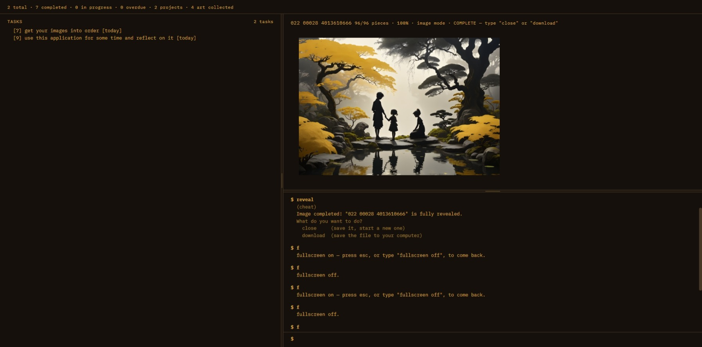
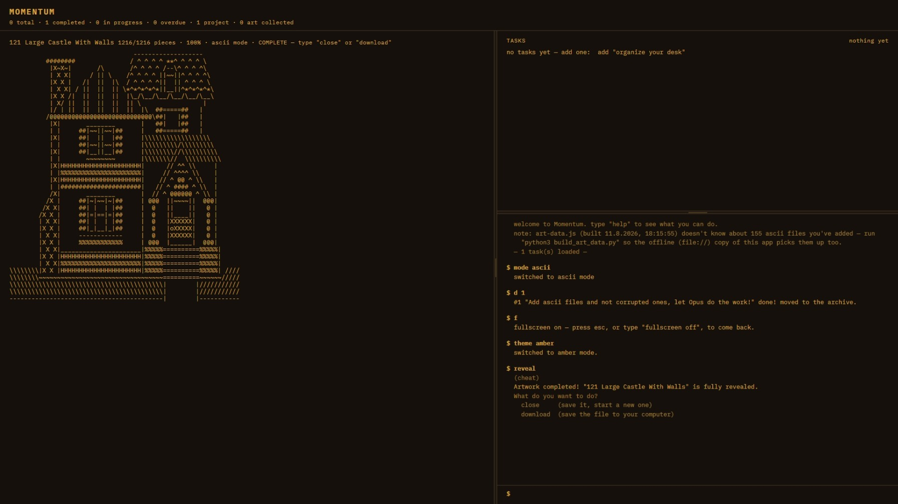
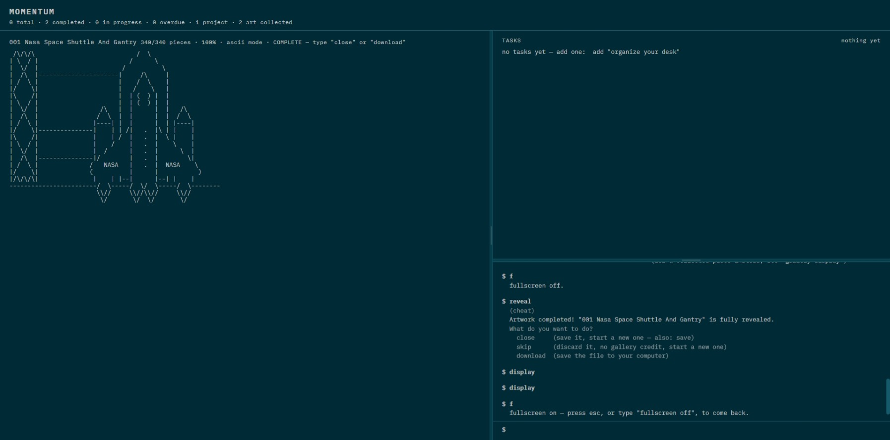
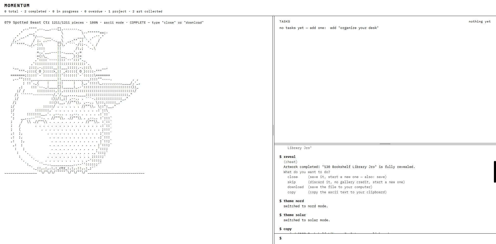

# Momentum

**A command-line task manager where finishing your work uncovers a piece of art.**

Every task you complete reveals part of a hidden ASCII artwork or image. Finish enough of them and the piece is yours — saved to a permanent gallery, or downloaded to your machine. Then a new one starts, still hidden.

It's a deliberate experiment in self-conditioning: pairing the boring, necessary act of crossing something off a list with a small, visible, accumulating reward.

```
$ add water the plants
added #1 "water the plants"

$ done 1
#1 "water the plants" done! moved to the archive.
```

*...and on the right, a little more of the picture appears.*

<!-- SUGGESTED: a short looping GIF right here — type a task, complete it, watch blocks
     pop off the image. ~10 seconds, no audio needed. This is the single highest-value
     addition to this README: the whole app is a visual feedback loop, and no amount of
     prose does what five seconds of watching it does. Record at a narrow window size so
     it stays readable at GitHub's ~800px content width. -->

---

## Gallery

<table>
  <tr>
    <td width="50%">
      
      <br><em><b>A finished piece.</b> 96 of 96 blocks uncovered — the app offers to save it to the gallery or download it, then starts a new one, hidden.</em>
    </td>
    <td width="50%">
      
      <br><em><b>Ascii mode, amber.</b> The artwork takes the full-height column, the task list is pinned above the console, and the header keeps the running count.</em>
    </td>
  </tr>
  <tr>
    <td width="50%">
      
      <br><em><b>The nord theme.</b> Five themes ship — <code>theme amber</code>, <code>night</code>, <code>day</code>, <code>solar</code>, <code>nord</code> — and every one is a whole-app palette, art included.</em>
    </td>
    <td width="50%">
      
      <br><em><b>Light, for daylight.</b> A completed ascii piece can also be copied straight to the clipboard as text — <code>close</code>, <code>skip</code>, <code>download</code> or <code>copy</code>.</em>
    </td>
  </tr>
</table>

These are stills, so the one thing they can't show is the part that matters: each task you finish pops a few more blocks off the picture, a piece at a time, until it's whole.

---

## Table of contents

- [Gallery](#gallery)
- [Quick start](#quick-start)
- [How the reward loop works](#how-the-reward-loop-works)
- [Your first five minutes](#your-first-five-minutes)
- [Command reference](#command-reference)
- [Keyboard and shortcuts](#keyboard-and-shortcuts)
- [Making it yours](#making-it-yours)
- [Adding your own art](#adding-your-own-art)
- [Your data, and how not to lose it](#your-data-and-how-not-to-lose-it)
- [Project structure](#project-structure)
- [Design notes](#design-notes)

---

## Quick start

**The fastest way** — double-click `momentum.html`. That's it. No server, no install, no build step, no dependencies. It runs entirely in your browser and saves to that browser's local storage.

**The nicer way** — run a local server from the project folder:

```bash
python3 -m http.server 8000
# then open http://localhost:8000/momentum.html
```

Both work identically for day-to-day use. The difference only matters when you're **adding your own art** — see [Adding your own art](#adding-your-own-art) below.

Type `help` at any time. It opens a short menu of command groups — `help tasks`, `help art`, `help layout`, `help data` — rather than one long wall; `help <command>` explains a single one (`help done`), and `help all` prints everything at once. `Tab` completes command names and their options.

---

## How the reward loop works

The screen is split. **Left:** your task list and a command prompt. **Right:** the artwork you're currently uncovering.

```
┌─────────────────────────────┬──────────────────────┐
│  TASKS            3 tasks   │                      │
│    [1] water the plants     │     ▓▓▓▓░░░░▓▓▓▓     │
│    [2] reply to Sam         │     ▓▓░░░░░░░░▓▓     │
│    [3] file the receipts    │     ░░░░  ░░░░░░     │
│ ─────────── drag ────────── │     ▓▓░░░░░░░░▓▓     │
│  $ done 1                   │     ▓▓▓▓░░░░▓▓▓▓     │
│  #1 "water the plants"      │                      │
│      done! moved to archive │   Wildflower · 40%   │
│  $ ▊                        │                      │
└─────────────────────────────┴──────────────────────┘
```

**One completed task = one payment toward the current piece.**

- In **ASCII mode**, each piece declares how many tasks it takes to fully reveal (5–8 for the bundled artworks). Each completed task uncovers its share of the characters, in random order.
- In **image mode**, the picture is cut into a grid of blocks, and each completed task pops off a fixed number of them (10 by default). You control both the block size and how many uncover per task — see [`block size`](#the-artwork) and [`block count`](#the-artwork).

When a piece is fully revealed, it freezes and waits for you:

```
Artwork completed! "Wildflower" is fully revealed.
What do you want to do?
  close     (save it, start a new one — also: save)
  skip      (discard it, no gallery credit, start a new one)
  download  (save the file to your computer)
  display   (see it fullscreen — esc/click to exit)
  (finishing another task skips it — "close" first to keep it)
```

`close` files it in your permanent `gallery` and starts a fresh hidden piece. `download` saves the real file to your machine first.

**It waits, but not forever.** A finished piece is a decision, and the next task you finish makes it for you: complete another task while one is sitting there and it's skipped exactly as if you'd typed `skip` — discarded, no gallery credit, a fresh piece starting from zero. So `close` it while it's in front of you.

### Nothing repeats until everything has had a turn

Pieces are picked randomly, but from a pool that excludes what you've already seen this cycle. You won't get the same artwork twice in a row while others are waiting.

---

## Your first five minutes

```bash
add buy coffee beans           # quotes are optional
add reply to Sam -p high       # ...but flags still work
add file receipts -d 2026-09-01 -t admin

list                           # see them all
start 2                        # mark one as in-progress
done 2                         # finish it — watch the art panel

art                            # how far along is this piece?
display                        # blow it up fullscreen (esc/enter/space/click to exit)

theme nord                     # try a different theme
mode image                     # switch from ASCII art to photographs
help                           # everything else
```

---

## Command reference

Most task commands accept **multiple ids** (`done 3,5,6`), **ranges** (`rm 1-4`), or **`all`** (`rm all`).

Anything that would affect more than three tasks at once asks for confirmation first. Anything that changes your data can be reversed with `undo`.

### Tasks

| Command | What it does |
|---|---|
| `add <title>` | Add a task. Quotes are optional — `add buy milk` works. |
| `add <title> -p high\|med\|low` | ...with a priority |
| `add <title> -d <date>` | ...with a due date — `friday`, `tomorrow`, `+3d`, `eom`, or `2026-01-31` |
| `add <title> +tag` / `+car,home,key` | ...with tags |
| `add <title> #project` | ...assigned to a project (created if new) |
| `rename <id> <new title>` | Fix a typo without delete-and-retype. One task at a time. |
| `start <id\|ids\|all>` | Mark task(s) active |
| `stop <id\|ids\|all>` | Put active task(s) back to pending |
| `done <id\|ids\|all>` | Complete task(s) → moves to archive, **pays out reveal progress** |
| `rm <id\|ids\|all>` | Delete task(s). Also `remove`, `delete`. Does *not* archive them. |
| `undo` | Reverse the last command that changed anything (20 deep, this session) |

### Organising

| Command | What it does |
|---|---|
| `priority <ids> <high\|med\|low>` | Change priority |
| `due <ids> <date\|none>` | Set or clear a due date. Takes `friday`, `tomorrow`, `+2w`, `eom`, or `2026-01-31`. |
| `tag <ids> add <tag>` | Add a tag |
| `tag <ids> rm <tag>` | Remove a tag |
| `tag <ids> set <tag1,tag2>` | Replace all tags |
| `tags` | List every tag in use |
| `project add <name>` | Create a project |
| `project rm <name>` | Delete a project |
| `project set <ids> <name\|none>` | Assign task(s) to a project |
| `project switch <name\|none>` | **Work inside one project** — the pane shows only its tasks and new ones join it (also: `switch project`) |
| `project list` | List projects (also: `projects`) |

### Seeing your work

| Command | What it does |
|---|---|
| `list` | Show active + pending tasks |
| `list all\|pending\|active` | Filter by status |
| `list #project` / `list +tag` | Filter by project or tag |
| `archive` | Show completed tasks (also accepts `#project` / `+tag`) |
| `find <text>` | **Search titles and tags — across your list *and* your archive at once** |
| `stats` | One-line summary of everything |

> The list is sorted meaningfully, not by insertion order: **overdue first, then active, then by priority.** A low-priority overdue task still outranks a high-priority one that isn't overdue.

### The artwork

| Command | What it does |
|---|---|
| `art` | Status of the current piece (also: `image`) |
| `next` | Skip to a new piece — no credit for the one you abandon |
| `reveal` | Cheat: instantly finish the current piece |
| `hide` | Cheat: re-mask it back to 0% |
| `close` | Once complete — file it in the gallery, start a new one |
| `download` | Once complete — save the real file to your computer |
| `gallery` | Your collection, as a contact sheet in the side panel |
| `gallery show <n\|name>` | Open one piece full-size — or just click its tile |
| `gallery close` | Back to the live reveal |
| `mode ascii\|image` | Switch reveal tracks |
| `folders [<numbers>]` | List the `image_art/` folders, or flip one in/out of the random pool |
| `block size <tier>` | Image granularity: `very small`, `small`, `medium`, `big`, `very big`, `full` |
| `block count <1-20>` | How many blocks one completed task uncovers |

> **`block size full`** makes a single completed task reveal an entire image. **`very small`** cuts it into ~300 blocks for a long, slow burn. Changing this mid-piece keeps what you've already uncovered — the same region of the picture stays visible, just redrawn at the new resolution.

### Look and layout

| Command | What it does |
|---|---|
| `theme <name>` | `amber`, `night`, `day`, `solar`, `nord` (also: `switch`) |
| `view art\|tasks` | Which panel gets the right-hand column |
| `split on\|off` | Pin the other panel above the terminal (on by default — drag the divider to resize) |
| `set [<key>] [on\|off]` | The on/off display settings — bare `set` lists them all |
| `display` | Blow up the current piece as large as the screen allows |
| `fullscreen [on\|off]` | Real browser fullscreen, F11-style |
| `clear` | Clear the terminal |

`set` covers four switches that used to be four separate commands — bare `set` shows all of them and their current state:

| Key | Controls |
|---|---|
| `title` | The MOMENTUM banner |
| `statline` | The `N total · N completed · ...` line under it |
| `mirror` | Flips the two columns left-for-right |
| `age` | The `[3d ago]` field on each task's details line |

> The old spellings still work — `title off`, `statline on`, `mirror` — they just route into `set` rather than being their own implementations. Task age is `set age on|off` only; it never earned a command word of its own. `set <key> toggle` flips one without naming a direction.

### Backups

| Command | What it does |
|---|---|
| `export` | Download a JSON backup of everything |
| `import` | Restore from a backup file |
| `recover [list\|<n>]` | Restore one of the last 10 automatic in-browser snapshots |

---

## Keyboard and shortcuts

| Key | Does |
|---|---|
| `Tab` | Complete the command name, or the option you're typing — press again to cycle |
| `↑` / `↓` | Walk back through your command history |
| `Esc` / `Enter` / `Space` / click | Exit the `display` overlay |

`Tab` knows what each command accepts, so `theme ⇥` cycles the five themes, `set ⇥` the four display keys, `block size ⇥` the six tiers, and `split ⇥` just `on`/`off`. An unambiguous completion adds a trailing space so the next `Tab` starts on the next argument.

Command history persists across reloads (the last 100), and `↑`/`↓` search by whatever you've already typed rather than just walking the list — type `do`, press `↑`, and only past commands starting with `do` come back. Type anything else and the next `↑` searches fresh against that.

Single-letter shortcuts for the commands you'll type most:

| | | | | | |
|---|---|---|---|---|---|
| `a` add | `d` done | `l` list | `s` split | `g` gallery | `u` undo |
| `n` next | `r` reveal | `x` close | `f` fullscreen | `c` clear | |

So a normal session looks like `a water the plants` → `l` → `d 1`.

---

## Making it yours

**Five themes**, each a complete palette: `amber` (the warm default), `night` (pure red on black), `day` (light), `solar` (solarized-inspired), `nord` (arctic blue-grey).

<!-- SUGGESTED: five small screenshots in a row here, one per theme, same task list and
     same half-revealed artwork in each so only the palette changes. Themes are pure
     visual appeal — a list of five colour names sells them far worse than seeing them. -->


**Work inside one project.** `switch project work` — or `project switch work`, they're the same command — narrows the task pane to that project *and* makes it the one new tasks join, so you can switch once and then `add` three things without typing `#work` on any of them. `Tab` after it lists your projects, so picking one is two words and a keypress rather than remembering what you called it. The pane header and the stat line both say which project you're in; `switch project none` leaves it — so does `filter off`, which clears the lot — and `#none` on a single task opts that one out without leaving.

```
$ switch project work
project: work — the task pane now shows 4 of 12, and new tasks join it.

$ add draft the proposal
added #13 "draft the proposal" [proj:work]
```

**The layout is yours to set.** `set title off` and `set statline off` reclaim the header, `set artline off` drops the caption above the artwork (the `art` command still reports where it is), `set mirror on` flips the columns left-for-right, drag the split divider to give the task list more or less room, or `split off` for a full-height terminal. Bare `set` shows every switch and where it currently stands. Every one of these preferences is saved with your tasks and comes back next time.

**And so is the font.** Twelve monospace faces ship with the app, grouped by mood. `font` prints them numbered and `font 11` picks one.

```
$ font
fonts  —  pick one with:  font <number>

  1.  IBM Plex Mono   ← current

  character
  2.  Azeret Mono          … DM Mono
  futuristic
  4.  B612 Mono            … Martian Mono
  modern
  6.  Fira Code            … Inconsolata, JetBrains Mono, Roboto Mono, Source Code Pro
  retro
  11. Courier Prime        … Space Mono

  on this computer
  13. System monospace     … plus whatever else is installed
```

Worth trying first: **Space Mono** is retro-futurist with real quirks, **Courier Prime** is Courier redrawn properly, **Martian Mono** is wide and engineered, and **B612 Mono** was drawn for aircraft cockpit displays. Every one is SIL Open Font Licensed — see [FONT_CREDITS.md](FONT_CREDITS.md) for designers and licences.

**`font next`** steps to the next one and wraps at the end, which is the fastest way to actually try them on — `next font` and `font prev` do what they look like. **`font info`** says what you're currently in:

```
$ font info
  name          B612 Mono
  style         futuristic
  source        bundled with the app (fonts/)
  size          16px
  weights       400, 700
  in the list   4 of 17   ("font 4" comes back here)
```

The list only ever offers fonts that are genuinely installed and genuinely fixed-width, so nothing in it can silently do nothing or quietly wreck the ascii art. (You can still name any font you like directly — `font Iosevka` — and if it isn't monospace the app says so and lets you have it anyway.) `switch font` works too, for the muscle memory.

**`font size 16`** makes everything bigger — title, tasks, metadata and ascii art scale together, keeping the design's proportions rather than flattening them. It takes `9` to `28`, relative steps (`font size +2`), and `font size reset`.

---

## Adding your own art

Drop files into the folders. That's the whole process.

```
ascii_art/          *.txt        — plain text artworks
image_art/          *.png *.jpg *.jpeg *.svg *.webp *.gif
```

Subfolders become categories automatically (`ascii_art/nature/tree.txt` → category "nature"), and filenames become titles (`desert-dunes.jpg` → "Desert Dunes").

**If you're running a server**, that's genuinely it — reload and they're there.

**If you're opening `momentum.html` directly** (the `file://` way), run this one command afterward:

```bash
python3 build_art_data.py
```

Browsers flatly refuse to let a `file://` page read a directory listing or fetch local files, so there's no way for the app to discover new art on its own in that mode. This script bakes a snapshot of both folders into `art-data.js`, which the page *is* allowed to load. It's the one genuinely unavoidable build step in the project.

> **You won't silently forget.** If you're running a server and the app notices files that your last `build_art_data.py` snapshot doesn't know about, it prints a gentle note telling you to re-run it — so the offline copy doesn't quietly keep showing an old set.

### Adding your own fonts

Same shape, same reason. Drop a webfont into `fonts/` and re-run its build script:

```bash
cp ~/Downloads/jetbrains-mono-400.woff2 fonts/
python3 build_font_data.py
```

It shows up in `font` on the next reload, no stylesheet edit required. `.woff2`, `.woff`, `.ttf` and `.otf` all work. Subfolders become the headings the `font` list groups by, exactly as they become categories in the art folders — `fonts/retro/vt323-400.woff2` files VT323 under "retro", and anything loose at the top level lists first.

The filename is the whole convention — `<family>-<weight>[-italic]` — so files sharing a family become one entry with its weights attached rather than several:

```
jetbrains-mono-400.woff2        ─┐
jetbrains-mono-700.woff2        ─┴─ one choice, "JetBrains Mono"
jetbrains-mono-400-italic.woff2 ─┘
```

`ibm-plex-mono.woff2` (no weight) is fine too — it's taken as the regular weight. Unlike the art folders there's no live-discovery path for fonts: `font-data.js` is how the app knows what's there, whether you're on a server or on `file://`.

### Fine-tuning a piece (optional)

Each folder has a `manifest.json` for overriding the auto-derived defaults. Every field is optional:

```json
{
  "artworks": [
    { "id": "tree", "name": "Old Oak", "category": "nature",
      "file": "nature/tree.txt", "revealTasks": 8 }
  ]
}
```

```json
{
  "images": [
    { "id": "sunset", "name": "Desert Sunset", "file": "examples/sunset.svg",
      "revealTasks": 8, "grid": { "cols": 6, "rows": 4 } }
  ]
}
```

`revealTasks` is how many completed tasks fully uncover that piece. `grid` is its default block layout (image mode only, and overridden by your `block size` setting if you've changed it).

### Where your art came from, and why it matters

If you only ever use your own files, skip this. If you're publishing your copy of this repo, read it.

Almost every photograph and artwork is copyrighted **automatically**, the moment it's made — there's no flag on the file to find, and no tool that can tell you otherwise. Stripped metadata proves nothing either way. The only reliable record is *where you got it*, and the only place to keep that is a note you write down at the time.

So `image_art/manifest.json` takes three more optional fields per image:

```json
{
  "images": [
    { "file": "space/heic0506a.jpg",
      "source": "https://esahubble.org/images/heic0506a/",
      "license": "CC-BY-4.0",
      "credit": "ESA/Hubble & NASA" }
  ]
}
```

Then:

```bash
python3 build_credits.py           # regenerates IMAGE_CREDITS.md
python3 build_credits.py --check   # exits 1 if any image has no recorded licence
```

This walks `image_art/` rather than the manifest, so an image dropped in without an entry is reported as unrecorded instead of quietly shipping uncredited. `--check` makes it usable as a gate before you publish.

Two things worth knowing:

- **"Free to use" often still means "with credit."** NASA/ESA/Hubble and ESO imagery, and most of Wikimedia Commons, is CC BY — genuinely free, but only if the credit line travels with it. `IMAGE_CREDITS.md` puts those in their own section so the requirement is visible rather than assumed.
- **Good sources exist.** Your own photos; [Unsplash](https://unsplash.com) and [Pexels](https://pexels.com) (no attribution needed); [Wikimedia Commons](https://commons.wikimedia.org), [ESA/Hubble](https://esahubble.org/images/) and [ESO](https://www.eso.org/public/images/) (credit needed). You don't have to give up photography — you have to give up *unattributed* photography.

Because the app discovers whatever is in the folder, the most robust thing to publish is a small set you can fully account for, and a line in your README telling people to drop in their own.

---

## Your data, and how not to lose it

Everything lives in your browser's `localStorage` — tied to the exact origin you loaded the page from. Nothing is sent anywhere. There is no account, no server, no telemetry.

That also means it can vanish: a new browser profile, cleared site data, private browsing, a different machine. So there are **three** layers of protection, in ascending order of durability:

1. **`undo`** — 20 levels deep, covers the mistake you just made. Session-only.
2. **`recover`** — the last 10 full snapshots, kept automatically in a second storage key. Survives your task list being wiped; does *not* survive the browser's site data being cleared.
3. **`export`** — a JSON file on your actual disk. **This is the only copy that leaves the browser**, and the only one that survives everything else.

Worth being precise about what each threat is, because they're usually lumped together:

- **Clearing the *cache*** doesn't touch your tasks at all. That's the HTTP cache; `localStorage` is separate.
- **The browser evicting storage on its own** — under disk pressure, or Safari's seven-day cap on script-writable storage for sites you haven't visited — is defended against: once you have a few tasks, the app quietly asks for [persistent storage](https://developer.mozilla.org/en-US/docs/Web/API/Storage_API), which exempts it from automatic eviction. Chrome grants this silently; Firefox asks. `stats` reports which you got.
- **Clearing site data deliberately** takes everything with it, and no web page can opt out of that — nor should one be able to. This is the gap `export` exists to fill, and the reason it's worth doing occasionally.

The app reminds you to `export` if it's been more than a week — or sooner if you've built up a real list without ever having exported, since that's the state with the most to lose.

```bash
export        # → momentum-backup-2026-08-05.json
import        # ← pick that file back up on any machine
```

---

## Project structure

```
momentum.html          the entire application — markup, styles, logic, one file
art-data.js            generated snapshot of both art folders (for file:// use)
build_art_data.py      regenerates the above
font-data.js           generated snapshot of fonts/ (same reason as art-data.js)
build_font_data.py     regenerates the above
IMAGE_CREDITS.md       source + licence for every shipped image (generated)
build_credits.py       regenerates the above from image_art/manifest.json
FONT_CREDITS.md        designer + licence for every bundled font (hand-maintained)
fonts/                 self-hosted webfonts, subfolders = categories
  retro/ futuristic/   19 monospace families, all SIL OFL
  modern/ character/
ascii_art/             .txt artworks, subfolders = categories
  manifest.json        optional per-file overrides
image_art/             image artworks, subfolders = categories
  manifest.json        optional per-file overrides, plus source/licence/credit
```

`momentum.html` is deliberately self-contained: no build tooling, no bundler, no `node_modules`, no framework, no external requests. Open it and it runs — including offline: the IBM Plex Mono font is self-hosted under `fonts/` rather than pulled from Google Fonts, so the double-click-and-go `file://` path looks exactly like the served one instead of silently falling back to system monospace.

---

## Design notes

A few decisions that aren't obvious from the outside:

**The id is the checkbox.** There are no `[ ]` marks in the list, because everything in the list is by definition unfinished — completing something moves it to the archive. The right-aligned `[3]` is both the marker and the thing you type.

**Unrevealed ASCII is blank, not dotted.** Placeholder dots traced the artwork's silhouette before you'd earned any of it, which gave away the shape and took the surprise out of the reveal.

**Fullscreen ASCII isn't scaled up.** Glyph size *is* the artwork — blowing characters up turns crisp texture into soft giant letters. So `display` in ASCII mode means "centered on a black screen with nothing else around it," and only ever scales *down*, for pieces too big to fit.

**Destructive commands ask, and stay reversible.** Anything hitting more than three tasks confirms first, and everything that changes state is undoable afterward. Two independent safety nets, because one mistyped `rm all` shouldn't be able to end your week.

---

## License & status

An experiment, built and iterated on in the open. Use it, fork it, rip out the half you don't want.
